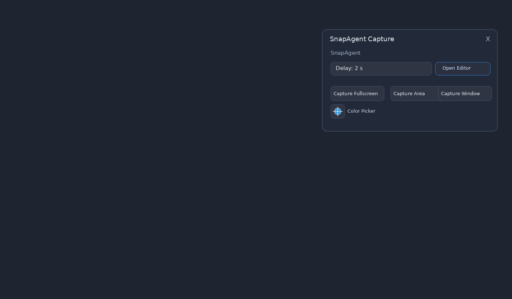
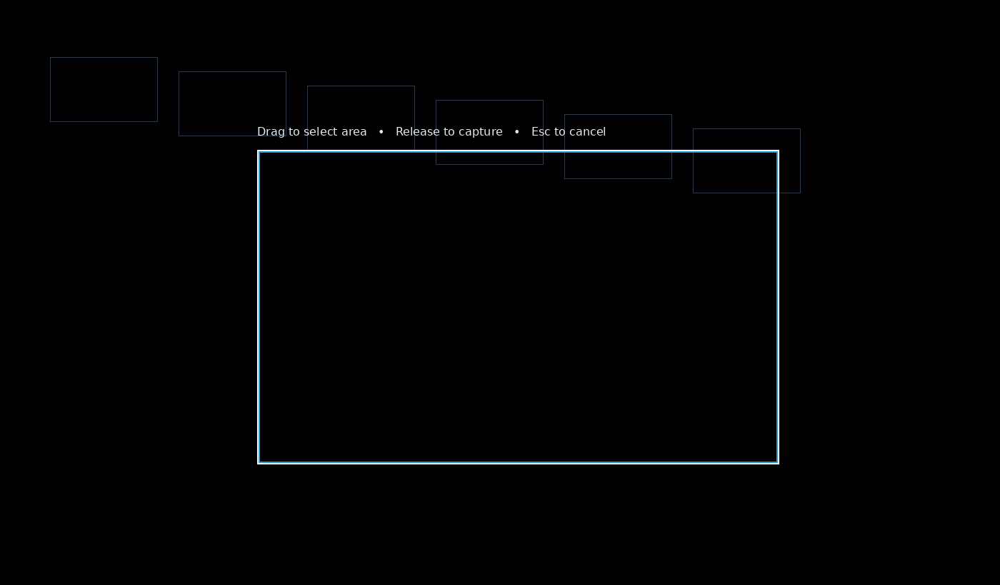
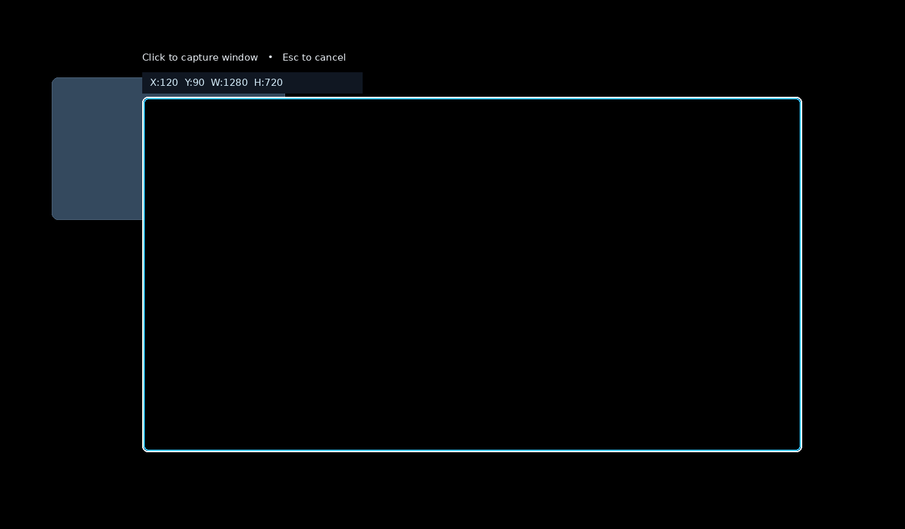
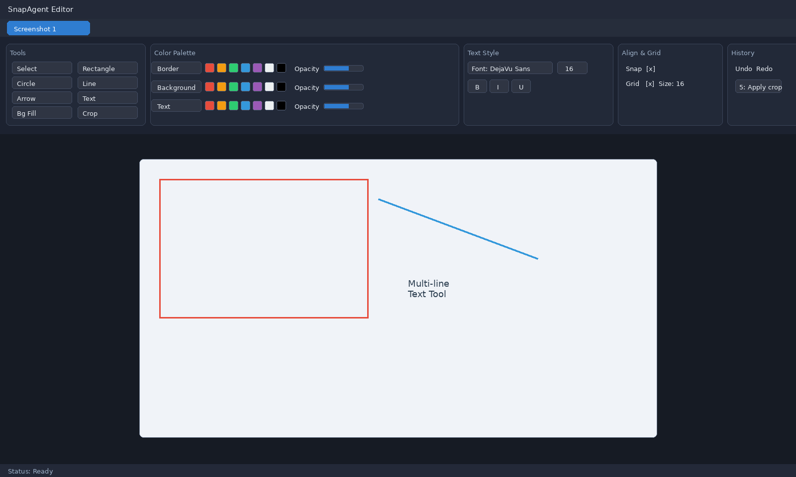
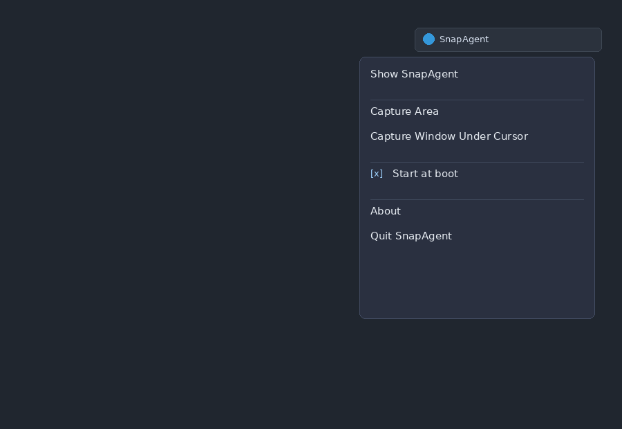
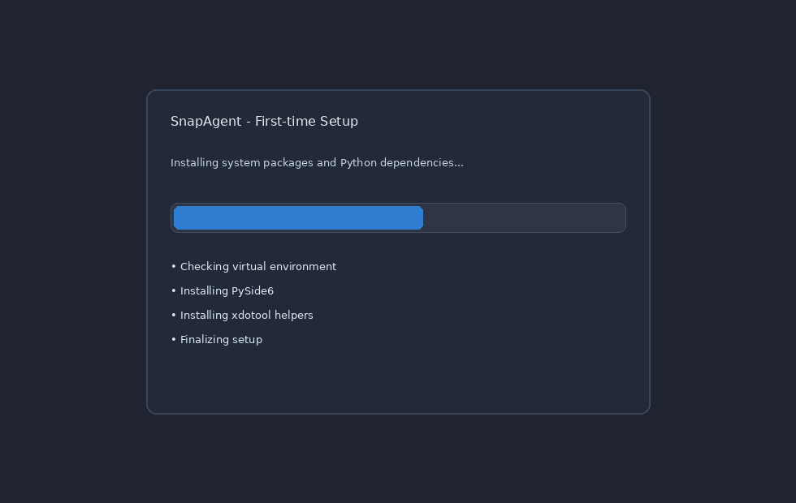

# SnapAgent

SnapAgent is a Linux screenshot and annotation application inspired by SnagIt.  
It combines fast capture workflows with a tabbed editor, non-destructive annotations, and project-based editing.

## Key Features

- Compact **Capture Panel** (delay slider, fullscreen/area/window capture, Open Editor link).
- **Color Picker Overlay** with cross-guides and clipboard copy.
- **Window Overlay** with live preview frame and `Esc` cancellation.
- Unified **Editor Host** with tabs for multiple screenshots.
- Annotation tools: `Select`, `Rectangle`, `Circle`, `Line`, `Arrow`, `Text`, `Bg Fill`, `Crop`.
- One-shot drawing + lock mode (double-click tool to lock).
- Editable elements with interactive resize handles.
- Full color workflow:
  - Border / Background / Text color
  - Per-target opacity sliders
  - Color palette quick buttons
- Text comfort features:
  - Font family dropdown
  - Font size dropdown
  - Bold / Italic / Underline toggles
  - Multi-line text input dialog
- History workflow:
  - Toolbar `Undo` / `Redo`
  - Labeled history list with jump-to-state
- Zoom workflow:
  - Slider + `+`, `-`, `Reset`
  - Ctrl + mouse wheel support
- Alignment aids:
  - Optional grid overlay
  - Snap-to-grid and magnetic alignment behavior
- Non-destructive crop behavior (annotations remain editable).
- Clipboard support for text, image, and image URL paste.
- Project format `*.sfp` (save/load editable projects).
- Export as PNG/JPEG/PDF:
  - Automatic file extension append
  - JPEG quality prompt
  - PDF DPI prompt
- Startup recovery:
  - Auto-save snapshot every 30 seconds
  - Restore prompt on startup if snapshot exists
- Linux integration:
  - Single-instance enforcement
  - Tray integration
  - Autostart toggle in tray
  - First-run dependency installer UI
  - Desktop shortcut prompt on first run

## Screenshots

### Capture Panel



### Region Overlay



### Window Overlay



### Editor Window



### System Tray Menu



### First-Time Setup



## Requirements

- Python `3.11+`
- Linux desktop session
- System tools for capture/window detection:
  - `xdotool`
  - `xwininfo`

## Install and Run

```bash
git clone https://github.com/joruf/snapagent.git
cd snapagent
python3 run.py
```

On first start, SnapAgent creates a local `.venv`, installs dependencies, and relaunches automatically.

## Usage Notes

- **Capture Panel**
  - `Capture Fullscreen`: captures complete virtual desktop.
  - `Capture Area`: opens drag-selection overlay.
  - `Capture Window`: opens live window selection overlay.
  - `Open Editor`: opens a blank editor tab if none exists.
- **Editor**
  - Use toolbar tool groups (`Tools`, `Color Palette`, `Text Style`, `Align & Grid`, `History`, `Zoom`).
  - Use `Ctrl+C` to copy composited image.
  - Use `Ctrl+V` to paste clipboard content.
  - Use `Enter` to apply active crop selection.
  - Use `Esc` to cancel crop selection or active capture overlay.

## Keyboard Shortcuts

- `Ctrl+S`: open export dialog
- `Ctrl+P`: print dialog
- `Ctrl+Shift+S`: save project as
- `Ctrl+O`: open project
- `Ctrl+Z`: undo
- `Ctrl+Y` / `Ctrl+Shift+Z`: redo
- `Ctrl+C`: copy composited image
- `Ctrl+V`: paste text/image/image URL
- `Ctrl + Mouse Wheel`: zoom
- `Enter`: apply crop
- `Esc`: cancel crop/overlay

## Project Format

SnapAgent saves projects as ZIP-based `*.sfp` files:

- `manifest.json` with metadata and annotations
- `assets/screenshot.png` as base image
- optional `assets/image-*.png` files for embedded pasted images

The format is versioned and migration-friendly.

## Release and Deployment

Distribution helper scripts are included:

```bash
# Debian package
./packaging/build_deb.sh

# AppImage package
./packaging/build_appimage.sh
```

Build artifacts are written to `dist/`.
